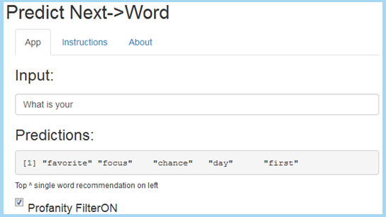
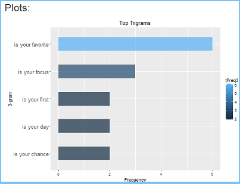

## Application Overview

- The "predict next->word" app can help reduce the amount of typing and typing errors on mobile devices.
- The app is based on N-Gram Language Models (LMs), where N is the number of words in a sequence.
- 1-gram, 2-gram, and 3-gram LMs were trained against the [Capstone English dataset](https://d396qusza40orc.cloudfront.net/dsscapstone/dataset/Coursera-SwiftKey.zip) of the HC Corpora consisting of: 
    * Blogs posts
    * News articles
    * Twitter tweets
- The tokenization was based on the paper titled ["Bigrams and Trigrams"](http://english.boisestate.edu/johnfry/files/2013/04/bigram-2x2.pdf), by Mr. John Fry, Boise State University.  
- The profanity filter uses the "bad word" list from [www.FrontGateMedia.com](www.FrontGateMedia.com).
- The spell checker is the Rasmus Baath's version of the [Peter Norvig spell checker](http://www.sumsar.net/blog/2014/12/peter-norvigs-spell-checker-in-two-lines-of-r/).

---

## The Algorithm
- The probabilities were calcualted using General Linear Interpolation (GLI) defined as:
    P(w3|w1 w2) = L1(h)*P3(w3|h) + L2(h)*P2(w2|h) + L3(h)*P1(w1|h)
    * Reference: ["Speech and Language Processing", page 16, figure 4.26 ](https://lagunita.stanford.edu/c4x/Engineering/CS-224N/asset/slp4.pdf)
- The GLI alogrithm is a combination of interpolation and "back-off" smoothing for unknown words. This makes lambdas conditional on the context (history - h) of previous lower order N-grams. This requires subsetting again to create a "held-out" set to train and find the lambdas(L1,L2,L3).
- The GLI used is based on the [MIT Natural Language Processing Notes](http://web.mit.edu/6.863/www/fall2012/lectures/lecture2&3-notes12.pdf), page 19, Fall 2012.
- Grams (words) substited were:
     * Unknown = \<u> token (Out of Vocabulary:oov)
     * Begining of sentence = \<b> token
     * End of sentence = \<e> token
     * Numbers = \<n> token
     * Profanity = \<FilterON!> token

---

## How it Functions
- It takes the last one, two ,or three words a user types/swipes/clicks in to search the LMs.
- It returns a word with the highest probability (on left) followed by four lower probability words. If the app cannot predict it defaults to the most common English word in the 1-gram LM, the word "the."
- The app works on any device with connectivity to Shinyapps.io.

INSTRUCTIONS
- INPUT: type english words and phrases into the first text box on top.
- OUTPUT: view predicted words in second text box. Check Profanity FilterON to toggle off.

Access:
- [Shiny app - https://rick2015.shinyapps.io/Predict_Next_Word](https://rick2015.shinyapps.io/Predict_Next_Word)
- [ui.R - https://github.com/Rick2015/Capstone_Project/blob/master/ui.R](https://github.com/Rick2015/Capstone_Project/blob/master/ui.R)
- [server.r - https://github.com/Rick2015/Capstone_Project/blob/master/server.r](https://github.com/Rick2015/Capstone_Project/blob/master/server.r)

---

## How it Looks

